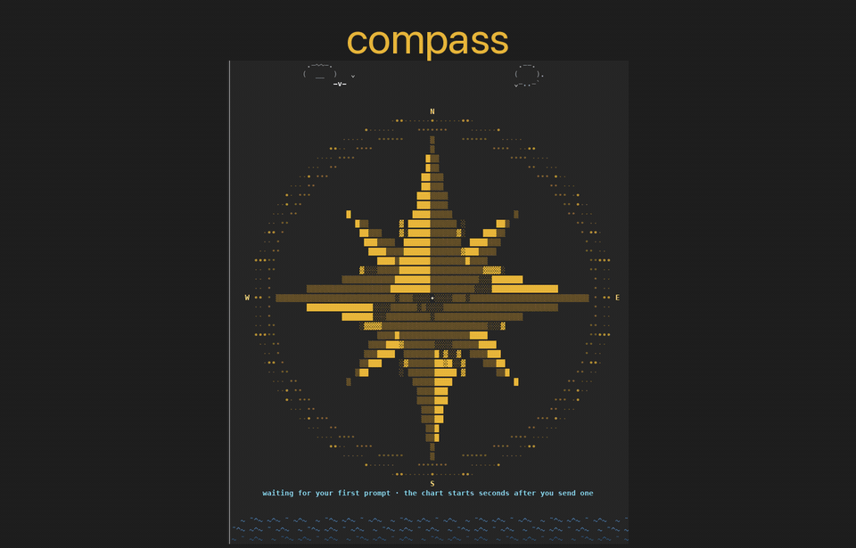

# 🧭 compass

<p align="center"></p>

<p align="center"><b>See</b> what your Claude Code session is doing · <b>project</b> where it is headed · <b>steer</b> it.<br><a href="docs/demo.mp4">Watch the demo video (MP4)</a></p>

A Claude Code mod that keeps a live map of your session: where you were, where you are, and where you're headed. It sits in a pane docked on the right, so the transcript keeps scrolling beside it, and you can steer the session from it.

Requires Claude Code 2.1.287 or later (`claude --version`).

## Install

```
/plugin marketplace add gil2abir/claude-compass
/plugin install compass@claude-compass
/reload-plugins
```

If it doesn't show up, restart Claude Code. From a local clone instead: `claude --plugin-dir ./claude-compass`.

## Use

The pane is drawn like a small GUI: indicators are graphics (colored pills, level bars, counters, lit dots for countdowns, a spinner while charting), and information (steps, tasks, questions, messages) stays text. Before the first chart lands, the flow tab shows an animated sea chart: a 32-point compass rose with clouds, gulls and waves, and a gull crossing it while compass works.

Click the gold `◈ compass` under the prompt to open or close the pane, or type `/compass`. Next to it, one panel of chips: the course (`✓ last │ ● now │ ○ next`), the current milestone (`⚑ M4 ██░ 1/5 steps`, the same M4 as in the flow tab), and chips for anything waiting on you (`? 2 to answer`, `⑂ 2 ways`, `⇣ 1 queued`). Short on room, parts leave a chip before whole chips go.

At the top of every tab, a **sync line** says what is going on with the chart and whether you need to do anything: `⠋ charting now · nothing to do`, `◌ chart coming · drawn in a few seconds`, `◌ 1 turn behind · updates when this turn ends`, or, when it needs you, `press ↻ update` with the button beside it. Under the flow, the **steer card** takes a sentence that points the whole session somewhere new; the steers you sent (yours, and go / skip / later / retry and fork picks) fold under it.

Pinned to the bottom of the pane, the **outbox**: everything the pane will put into the session, one line per item, marked by when it goes: `↪` into this turn, `⏭` as the next turn, `✎` with your next prompt. Every item waits 8 s (with a countdown) before it is sent, so you can still change your mind: click to preview the exact text, `▲▼` to reorder, `⚡` to send now, `✕` to remove (what it did in the pane is undone). `✓n` unfolds what was already sent.

| Tab | What it shows |
| --- | --- |
| `├ flow` | The session's milestones (numbered `M1`…, each with its own steps bar, overall progress on top), drawn as a git-style flow chart: finished milestones folded, a fisheye around **now**, dead ends and side branches, decisions. Click a step for **go / skip / later / retry**. `key` explains every mark. When the last turns show the work could go another way, the active milestone forks: **as planned** on the left, one **branch** on the right (`⑂ 2 ways` under the prompt). Once you pick a side, that fork (either side of it, reworded or reversed) isn't offered again, even while the work waits on an event or a decision. `▶ keep this` stays the course; `⤴ take this` steers the session there and redraws the flow at once (✕ in the outbox undoes it before it's sent). |
| `☑ tasks` | A Jira-style board: DOING (limit 3), TO DO, DONE, BACKLOG. Drag cards between lanes, or click one for move buttons. Add your own tasks; the agent takes them next turn. |
| `? grill` | A decision radar. Questions that need you land here as the session moves: Claude posts them while planning or at a choice, and after every turn compass looks for new goals, ideas, trade-offs and effects down the road you should decide or know about. Each says whether work waits on it (`⏸ blocking`) or goes on meanwhile (`▶`). Answer any, in any order, when you like (options, free text, or `?` for a follow-up); `⏸ park` one to let the work go on with Claude's recommendation; `✕` to drop it; bring parked ones back any time. The session hears every choice, the chart settles questions the conversation already answered, and the flow tab mirrors it all in a **decisions** block (waits on you · open while work goes on · answered · parked). |
| `⇄ chat` | Other Claude sessions and agents (via `ListAgents`) and the Remote Control indicator. Each agent shows `● N new`, `◂in ▸out` counts and its last message; click one for a summary and its history, one line per message (`◂ in` / `▸ out`, age, first sentence), click a line to read it all. Messages the session's Claude sends with SendMessage are recorded too. |
| `∑ stats` | Session time, turns, tools, errors, files, cost, context, progress, and compass's own token use. |
| `≡ recap` | A short recap you can copy, plus your `/btw` side questions. |

Long text wraps instead of being cut off.

Commands: `/compass`, `/compass refresh`, `/compass steer <text>`, `/compass task <text>`.

## How it works and what it costs

- The map is made by one extra model call (`$.model.fork`) that reuses the session's prompt cache: 3 s after each prompt (so the first chart arrives while Claude is still working on your first request), again when each turn ends, and every 3 min during long turns. The stats tab shows compass's own token use.
- The agent gets a `grill` tool and short instructions in its system prompt for asking you questions without blocking.
- The chart is saved in the plugin's own store (`$.store`), so `claude --resume` reopens it without charting again; the 12 most recent sessions are kept.

## What compass reads, sends, runs and stores

A mod runs on your machine with the same access Claude Code has. Read the source (`hooks/register.tsx`, `hooks/board.tsx`, `hooks/brand.tsx`, `hooks/pill.tsx`) before installing. In short:

**Prompts it submits.** Only what you put in the outbox, exactly as the outbox previews it (click an item to see the text): steers you type or pick (go, skip, later, retry, take a branch), task changes you make on the board, your grill answers and dismissals. Each waits 8 s in the outbox and can be removed. They go in as a new turn (`prompt.submit`), into the running turn (`session.append`), or as context on your next prompt. Compass never puts file contents in a prompt.

**Model calls.** To draw the chart it makes one extra call to the session's own model (`model.fork`): it sees the session's conversation, which is already with that model, plus compass's state (the current chart, tasks, sent steers, grill questions, decided forks, messages from other agents). Nothing is added to your session's history.

**Tools it calls itself.** `ListAgents`, to list your other sessions and agents in the chat tab (when the pane opens and every 15 s while the chat tab is shown), and `SendMessage` (through `session.send`) when you send a message from the chat tab. It registers one tool of its own, `grill`, which the agent uses to post questions; compass's `tool.call` hook answers that tool and no other.

**Hooks, and what each does.** All pass the event on unchanged unless noted:
- `tool.call` (every tool): counts tools and errors for the stats tab, notes edited files, reads TodoWrite/TaskCreate for the task board, reads ListAgents results for the chat tab. Answers only its own `grill` tool.
- `command.run`: `/compass` is compass's own command (it answers it); `/btw` is recorded as a side question and passed on.
- `prompt.submit`: adds your queued "with your next prompt" notes as context; records `/btw`.
- `prompt.compose`: adds the grilling guide and the steers you sent to the system prompt.
- `session.send` / `session.receive`: records chat messages to and from other sessions.
- `session.start` / `session.end`, `turn.start` / `turn.complete`: keep the chart current; `/clear` starts the compass over.
- `ui.render`, `ui.message`, `ui.scroll`: draw the pane and the row under the prompt.

**What it reads.** The session's messages and usage (`session.messages`, `session.usage`) for the chart and the stats. It reads no files, no environment variables and no credentials.

**What it writes.** No files. It keeps each session's compass in its own plugin store (`$.store`, a JSON file Claude Code keeps for the plugin) so `claude --resume` reopens it; the 12 most recent sessions are kept and `/clear` removes the current one.

**Network.** None of its own. The `repository` link in `plugin.json` is metadata.

The `types` field in `plugin.json` names the mod's state contract (`types/index.d.ts`), which `claude plugin validate` checks; Claude Code itself ignores it. `tests/` is the test suite for `claude plugin test`: its hooks stand in for the engine (they answer tool calls, the store and model calls with fixed data).

## Update

```
claude plugin marketplace update claude-compass
claude plugin update compass@claude-compass
```

From a clone: `git pull`. Then restart each session (`/exit`, `claude --continue`).

## Develop

```
claude plugin validate .
claude plugin test .
```

## License

MIT, see [LICENSE](LICENSE).
